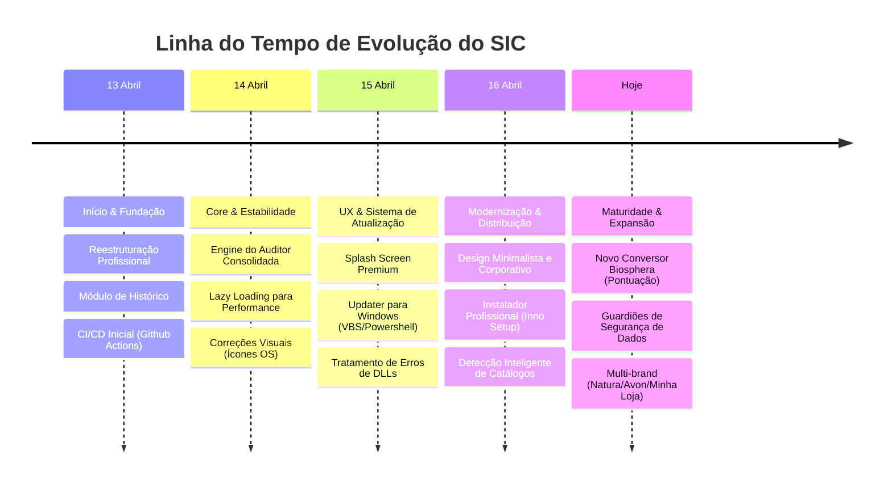
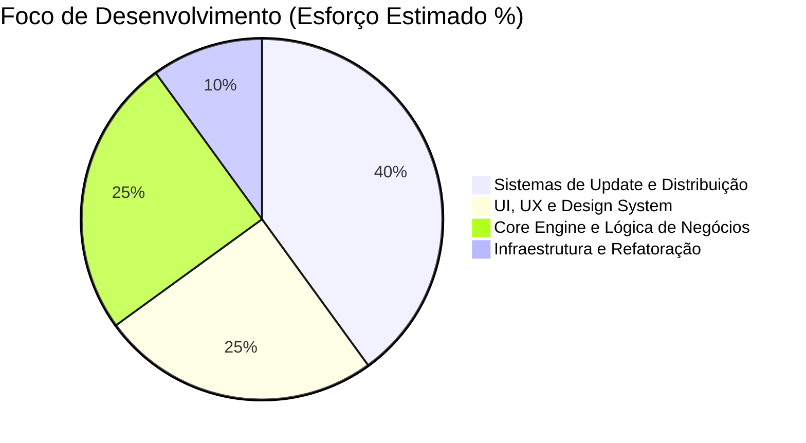

# Evolução e Análise do Projeto SIC

Esta análise mapeia o progresso do sistema desde a sua concepção inicial até a arquitetura madura e moderna que possui hoje. Nenhuma linha de código foi alterada para a geração deste relatório.

## 📊 Linha do Tempo de Inovações

Abaixo, um panorama temporal das grandes entregas que moldaram o sistema:

## 🎯 Distribuição de Esforços

Analisando o histórico de commits e entregas, podemos categorizar onde o esforço técnico foi mais concentrado para gerar valor:

> [!TIP]
> Observa-se que **40% do esforço** foi focado em garantir que os usuários sempre tenham a versão mais recente sem atritos (Sistema de Atualização, Inno Setup, PowerShell Guardian), demonstrando um foco enorme em **confiabilidade e distribuição**.

---

## 🔄 O Antes e o Depois (Evolução)

### 1. Identidade Visual e Experiência do Usuário (UI/UX)
* **Como Era:** Design funcional, mas básico. Ausência de indicadores visuais de carregamento e dependência de componentes padrão.
* **Como Está:** Interface **minimalista e corporativa** (tema dark mode polido). Implementação de um **Splash Screen premium** que melhora a percepção de tempo de carregamento. O sistema agora possui escala dinâmica de fontes, controle de acessibilidade e ícones nativos perfeitamente integrados ao Windows/macOS. As áreas de drag-and-drop agora possuem feedback visual inteligente (detecção de marcas em tempo real).

### 2. Arquitetura e Lógica de Negócios (Core Engine)
* **Como Era:** Lógica descentralizada, baseada na transcrição do JavaScript original, suscetível a erros de importação e formatação.
* **Como Está:** A engine do Auditor foi unificada, possuindo **Guardiões de Segurança** que bloqueiam dados incompletos ou duplicados antes do processamento. Expansão massiva para suportar múltiplas marcas (Natura, Avon, Minha Loja) simultaneamente, culminando na criação do robusto módulo **Conversor Biosphera (Pontuação)**, capaz de cruzar dezenas de colunas dinamicamente (SKU, ZEST, CV).

### 3. Distribuição e Ciclo de Vida (Update System)
* **Como Era:** O usuário precisava baixar as atualizações manualmente ou lidar com processos travados durante o fechamento do app.
* **Como Está:** Criação de uma verdadeira "blindagem" (Update Guardian) rodando scripts via PowerShell/VBScript em background. O app se atualiza de forma silenciosa, contorna bloqueios de permissão do Windows, reinicia sozinho e entrega a nova versão através de um **instalador profissional (Inno Setup)**.

### 4. Performance e Estabilidade (Under the Hood)
* **Como Era:** Lentidão na abertura (carregamento síncrono de todas as telas) e conflitos recorrentes com DLLs (PyInstaller) e processos "órfãos".
* **Como Está:** Arquitetura `onedir` implementada, garantindo inicialização rápida através de **Lazy Loading** (telas só são carregadas quando abertas). Isolamento rigoroso de variáveis de ambiente no Windows para evitar o famoso erro de *"failed to load python dll"*.

> [!NOTE]
> **Conclusão:** O projeto deixou de ser apenas um "script utilitário com interface gráfica" e tornou-se um **software corporativo completo**. A fundação foi fortificada de tal forma que o foco mudou de "corrigir bugs de infraestrutura" para "entregar valor e inteligência de negócio", como provado pelas integrações recentes do módulo de Pontuação.
